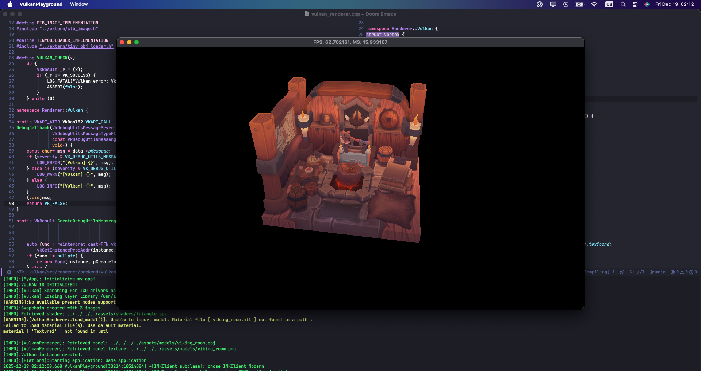
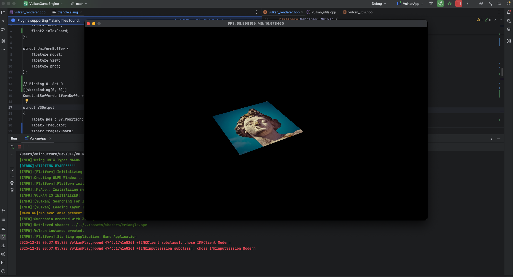
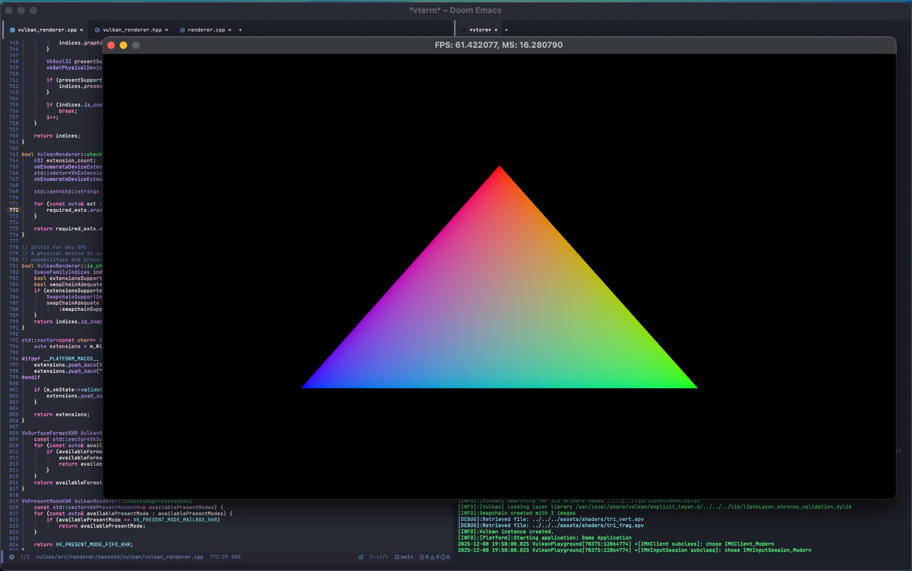

# Vulkan Project

A Vulkan game engine designed to aid my understanding of game engines, computer architectures, platform abstractions, optimizations (through vector instructions such as SIMD), and build a fully-fledged architecture and system to experiment with things.

## Project Structure

I intend to build the core engine as a static library, and later link it with a `playground` code. This way, the whole engine would be a collection of "plugins", i.e. static libraries, that all link up to form an application. For example, there would be the `core` library, the `ui` library that implements ImGui, the `audio` library that implements audio, the `math` library (if GLM is not used), and the `physics` library.

- `src`:
  Contains the source code of the project.
  - `core`:
    Contains core related source code, including `memory` submodule for custom allocators, and application logic
  - `platform`:
    Contains platform related source code, which aims to provide an abstraction over platform used. Currently supported platform is GLFW (which in itself is univeral), though in the future Linux, Windows, and MacOS specific functionality will be implemented.
  - `renderer`:
    Contains rendering related source code, together with renderer backend implementations.
- `playground`:
  Contains the playground source code, which links the engine static library.
- `test`:
  Provides GoogleTest tests for specific engine functionalities.

## Roadmap

- [x] Set up development environment with CMake
- [x] Extract engine source from playground source, making engine a static library (TODO: Change to dynamic library in the future)
- Platform independence layer
  - [x] Platform detection
  - Collections & Iterators
  - File system
  - Vulkan/OpenGL Wrapper
- Core Systems
  - Start-up & Shut-down logic
  - [x] Assertions
  - Memory Allocators (stack, doubly stack, pool allocators) (TODO: Avoid fragmentation)
  - Math library (SIMD optimized?)
  - Strings & String IDs
  - Logging
  - Parsers (Schema, CSV, Json)
  - Engine config
  - Async File IO
- Resource
  - Resource Manager
  - Texture resource
  - 3D Model resource
  - Material resource
  - Font resource
  - etc.
- Renderer Backend
  - Materials & Textures & Shaders (SPIR-V)
  - Cameras & Projections
  - Lighting (static & dynamic)
  - Primitive submissions to GPU
- Renderer Frontend
  - Light mapping & Dynamic Cascaded Shadows
  - PBR lighting
  - Post effects
  - Deferred rendering
  - Clustered rendering

## Logs

#### Model Loading (19-12-2025):

#### Spinning Texture (18-12-2025):

#### Hello Triangle (8-12-2025):

